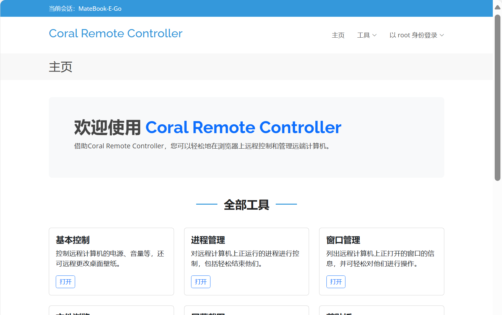

# Coral Remote Controller
Coral Remote Controller is a browser-based remote controller with some useful functions for Windows computer in local network.

## Introduction
### Fuctions
+ Basic arrangement for power, audio, process, windows, clipboard,  wallpaper and network hosts.
+ Real-time screenshot, listing and downloading any file from client computer, sending message to controlled computer and check system info of client computer.
+ Support multi-user to visit remote client conmuter with different authorities (admin, std, guest) at the same time.
### Disclaimer
+ ** Due to limited test in security, DO NOT USE IT IN COMMERCIAL, SECURITY AND PUBLIC NETWORK! **  
+ ** WE ARE NOT RESPONSIBLE FOR ANY LOSS OR CONSEQUENCE CAUSED BY ANY ABUSE OR MISUSE OF THIS SOFTWARE. **

## System requirements
+ **Client: ** Windows 7 SP1及以上，基于x64或ARM64架构的Windows计算机。系统上没有安装其他基于Apache服务器的网站和程序，并且系统的8088端口没有被占用。暂不支持在有多个用户的操作系统环境下使用Remote Controller。  
+ **Controller: ** 装有现代浏览器（不包括IE浏览器），能连接到局域网的任意设备。

## Installation and Usage
### Set up Client
1. 将Remote Controller安装包完全解压至合适的位置（建议可以放在系统盘Program Files文件夹下）。
2. 双击打开“vc_redist.x64.exe”，并按照提示安装依赖的运行库。如果出现“已经安装这个产品的另一个版本”的错误，则跳过此步骤。
3. 在运行库完全安装好（包括重启系统）后，右键解压出文件夹下的“install.bat”并选择“以管理员权限运行”。等待安装脚本自动执行并自动退出。
4. 在托盘图标中找到Remote Controller的托盘图标，右键并选择“打开Remote Controller管理页面”，按照提示进行root用户初始化设置。
5. 之后可以使用该root用户，从右上角菜单进入“后台管理”，更改设置并添加更多用户。
### Visit Client from Controller
1. 将远控设备连接到被控端所在的局域网内，并查询被控端在局域网上的IP地址。可以通过路由器管理页面，或者在被控计算机Remote Controller右键菜单中选择“列出本机所有IP地址”找到被控端在局域网上的IP地址。
2. 在远控端浏览器上打开被控端的8088端口。即如果查询到的IP地址为“192.168.1.5”，则访问网址“http://192.168.1.5:8088”。
3. 登录相关账户，开始远程控制。
### 远程更新被控端的Remote Controller
+ 以root权限登录Remote Controller后，进入后台管理->程序更新，直接上传新版本的完整zip安装包，然后按照提示操作。更新的过程中可能会出现短暂的页面无响应，请耐心等待。
### 卸载被控端的Remote Controller
1. 如果要删除Remote Controller数据，则先以root登录Remote Controller，在后台管理->系统设置中选择“重置 Coral Remote Controller”以清空所有数据。
2. 打开Remote Controller所在的文件夹，右键并选择以管理员权限运行“uninstall.bat”，等待卸载脚本自动执行并自动退出。
3. 删除Remote Controller文件夹及其下的所有文件。

## Q&A
### 使用intall.bat启动服务时出现“错误 1”，且管理网站不能访问？
+ 首先，install.bat需要以管理员权限运行。如果问题仍然存在，大概率是Windows自带的解压工具不能完全解压所有文件（你会发现Website文件夹下面少了一些东西）。以管理员权限运行uninstall.bat卸载服务后更换一个解压工具（如7zip、WinRAR）再次解压，再重新安装即可。
### “login/index.exe”被Defender识别为病毒，无法进入登录页面？
+ 允许这个“威胁”并将相关文件添加到白名单即可。Remote Controller的源代码已经公开，不会有病毒。
### Coral Remote Controller 是一个病毒/黑客工具吗？
+ Remote Controller不是一个病毒/黑客工具。
+ Remote Controller的安装与配置均需要以常规手段在被控计算机上以管理员权限进行操作，无法越权、远程侵入和渗透。
+ Remote Controller的功能设计并非为侵入远程计算机而设计，而是为使用浏览器进行一些基本的有限远程控制而设计。
+ **本人强烈反对一切不尊重他人隐私，随意侵入他人计算机的不良黑客行为。**
## Thanks page
The project contains many opensource project and thridparty resources. I would like to express my gratitude all at once.
### Front-end webpage
+ Bootstrap
+ Vesperr Template (BootstrapMade.com)
+ jQuery
+ glightbox
+ sweetalert
+ aos
+ jsencrypt
+ bootstrap-auto-dark-mode
+ notyf
+ pdf.js
+ docx.js
+ jszip
+ marked
### Back-end program
+ Apache
+ GNU CgiCc
+ 7-Zip
+ libjpeg
+ openssl
+ jsmpeg-vnc
### Illustration
+ Bing Wallpaper
+ Windows Spotlight